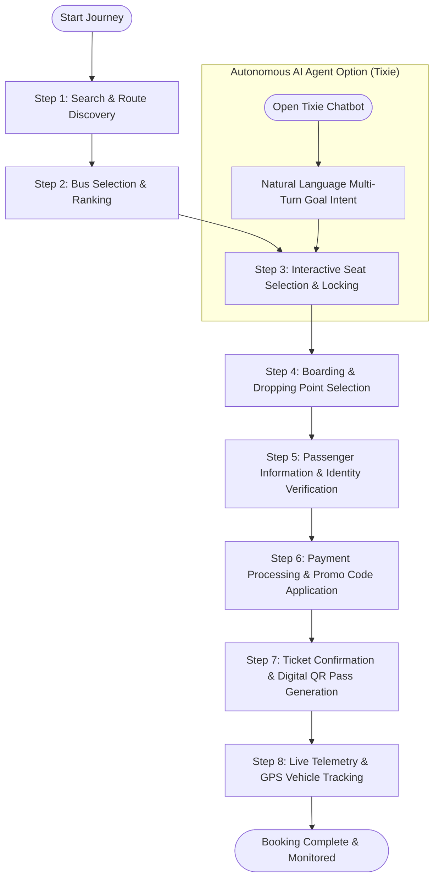
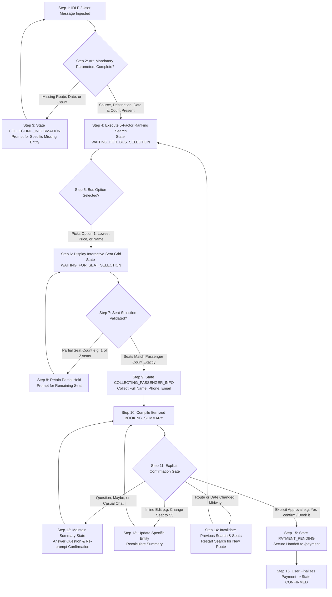
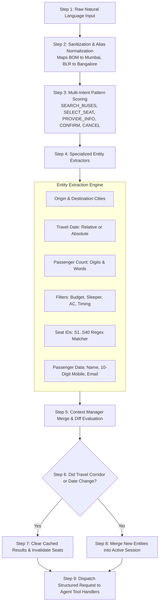
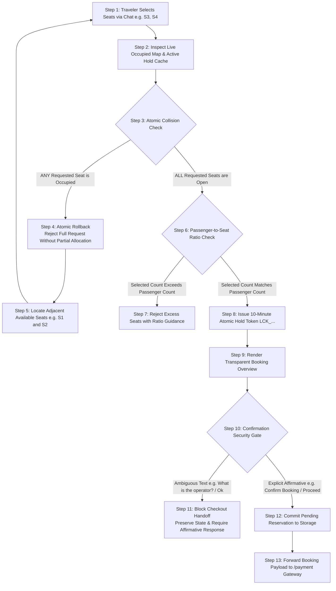

# GoTicket — Anti-Gravity Intercity Bus Reservation Platform

## Project Overview
GoTicket is an intelligent intercity bus reservation platform that unifies real-time route discovery, interactive seat locking, and live telemetry tracking into a single web application. Travelers can complete reservations manually through an intuitive web interface or converse directly with "Tixie," an autonomous AI travel agent that validates seats, enforces booking constraints, and confirms tickets.

---

## Workflow Flowchart



---

## Tixie AI Agent Workflows & Flowcharts

### 1. Multi-Turn Conversational State Machine (`travelAgent.js`)
Demonstrates how Tixie handles the conversational lifecycle, collects required travel parameters, gracefully adapts to midway user changes, and enforces validation gates.



### 2. NLU Intent Classification & Entity Extraction Pipeline (`nluService.js`)
Illustrates how Tixie cleans raw user text, identifies user intent, extracts travel entities, and manages dialogue context across conversational turns.



### 3. Atomic Seat Allocation & Confirmation Gate Architecture (`seatService.js`)
Depicts how Tixie guarantees seat inventory integrity, detects double-booking collisions, suggests adjacent alternatives, and protects travelers from accidental checkout.



---

## Step-by-Step Guide

### Step 1: Search & Route Discovery
* **Description**: The user enters departure city (Source), destination city, travel date, and optional filters (e.g., departure time, bus type, maximum budget).
* **Prerequisites**: Source and destination cities selected from supported corridors (50+ Indian cities supported with automated city-alias matching).
* **Expected Output**: A list of verified schedules matching the chosen route and date.

### Step 2: Bus Selection & Ranking
* **Description**: Users view available services sorted by departure time, fare, or operator rating. An intelligent 5-factor scoring engine highlights the recommended best option based on price, timing, and travel duration.
* **Prerequisites**: Valid route results retrieved from Step 1.
* **Expected Output**: One bus schedule selected with verified operator details, bus category (AC Sleeper, Volvo Multi-Axle, AC Seater), and base fare.

### Step 3: Interactive Seat Selection & Locking
* **Description**: An interactive 40-seat bus layout (2 Left + Aisle + 2 Right) allows travelers to click and select open seats. The system executes an atomic hold request to lock seats for 10 minutes, preventing double-booking.
* **Prerequisites**: Minimum of 1 available (unsold) seat chosen.
* **Expected Output**: Selected seats highlighted with calculated subtotal and an active seat hold token (`LCK_...`).

### Step 4: Boarding & Dropping Point Selection
* **Description**: Travelers designate exact pickup stops and final destination drop-off points along the travel corridor, complete with local landmark addresses and scheduled stop times.
* **Prerequisites**: Successful seat hold from Step 3.
* **Expected Output**: Selected pickup and drop locations saved to the active booking payload.

### Step 5: Passenger Information & Identity Verification
* **Description**: The traveler provides primary and co-passenger details including full name, age, gender, contact phone number, email address, and masked Aadhaar proof for security compliance.
* **Prerequisites**: Boarding points confirmed from Step 4.
* **Expected Output**: Validated passenger profiles attached to the pending reservation record.

### Step 6: Payment Processing & Promo Code Application
* **Description**: The checkout screen presents an itemized fare breakdown. Users can apply instant discount coupons (such as `FIRSTGO` or `UPIPAY`) and select a preferred payment method (UPI, Debit/Credit Card, or Cash on Board).
* **Prerequisites**: Valid passenger information from Step 5.
* **Expected Output**: Total fare recomputed with any applied discount, followed by payment validation.

### Step 7: Ticket Confirmation & Digital QR Pass Generation
* **Description**: Upon payment confirmation, the system creates a verified reservation, generates a unique PNR (`GTXXXXXX`), stores the record in persistent storage, and displays a printable digital pass featuring a scannable QR boarding pass.
* **Prerequisites**: Successful payment or cash reservation selection from Step 6.
* **Expected Output**: Confirmation screen presenting the confirmed PNR, passenger manifest, route details, and links to download PDF passes or view the E-Ticket.

### Step 8: Live Telemetry & GPS Vehicle Tracking
* **Description**: Travelers can track their allocated bus on an embedded interactive OpenStreetMap interface showing live vehicle GPS coordinates, estimated speed, route waypoints, and distance to destination using the Haversine formula.
* **Prerequisites**: Confirmed PNR or valid bus registration number from Step 7.
* **Expected Output**: Live telemetry map displaying real-time bus position and route progress checkpoints.

---

## Quick Start

### 1. Prerequisites
Ensure you have the following installed on your machine:
* **Node.js** (v18.0 or higher)
* **npm** (v9.0 or higher)

### 2. Installation
Clone the repository and install all dependencies:
```bash
git clone https://github.com/jaishree-verma/Go-Ticket.git
cd Go-Ticket
npm install
```

### 3. Environment Configuration
Verify your local environment file (`.env`):
```env
PORT=5001
BACKEND_PORT=5002
BACKEND_URL=http://localhost:5002
```

### 4. Run the Application
Start the frontend development server and backend proxy:

```bash
# Terminal 1: Start the backend API proxy (runs on port 5002)
node server/server.js

# Terminal 2: Start the React frontend application (runs on port 5001)
npm run dev
```

Open [http://localhost:5001](http://localhost:5001) in your browser.

### 5. Running the Test Suites
Run unit, seat-locking, and conversational workflow integration tests:

```bash
# Run seat locking and payment validation integration test
npm test -- src/services/seatAndBookingFlow.test.js

# Run the 12-scenario conversational AI test suite
npm run test:workflow
```

---

## License
This project is open-source and available under the [MIT License](LICENSE).
